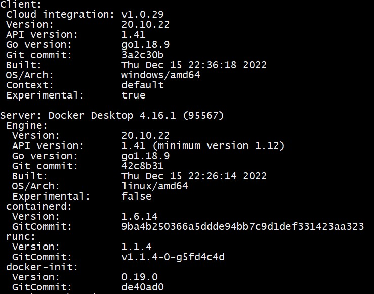
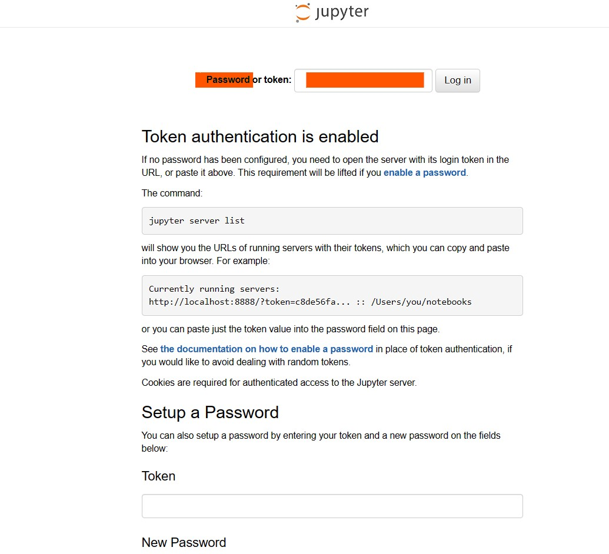
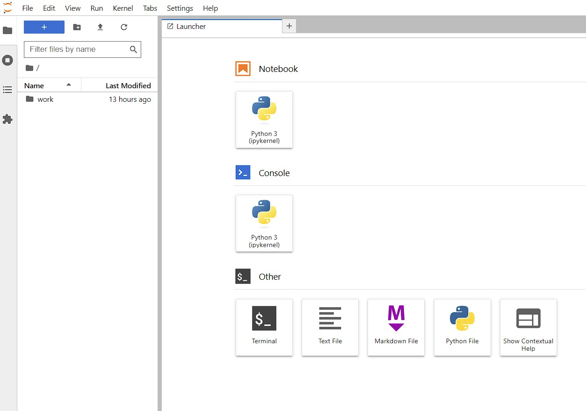
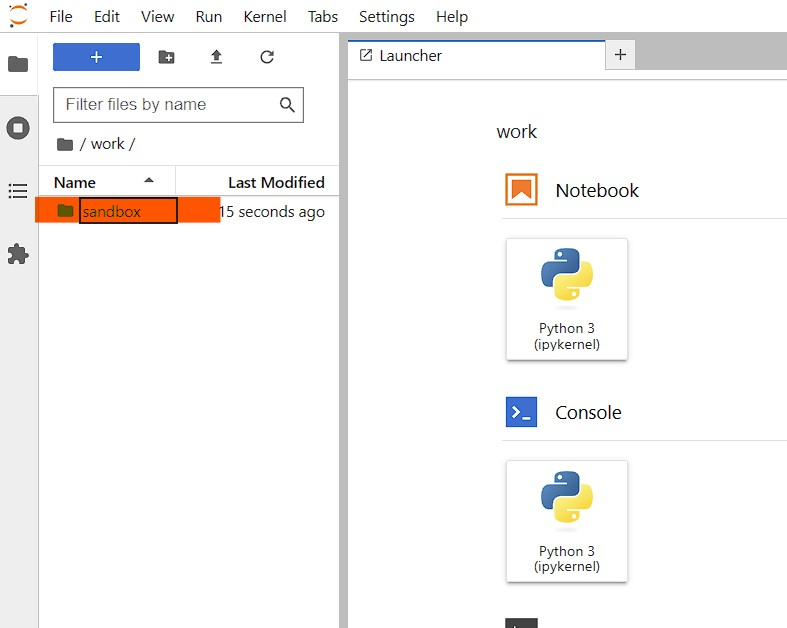

# Sandbox

## Motivation
"Code in the wild" for data science application are the perfect starting point to learn something new. Unfortunately, it is very painful to get the code running especially if you are not familiar with the detailed information about the environment setup.

This issue can be solved by using a development environment running in a Docker container, which is created by a predefined Docker image see [Jupyter Stack](https://jupyter-docker-stacks.readthedocs.io/en/latest/). The developer can provide the code and the related development environment. Then the code can easily be executed and the provided outputs are reproduced. No time wasting effort anymore for create a suitable development environment!

## Get Docker for Windows
Before you can start, you need to install [Docker for Windows](https://docs.docker.com/desktop/install/windows-install/). If you are not familiar with the installation of Docker for Windows you can use an installation guide provided on for example [Youtube](https://www.youtube.com/). 
If you have successfully installed Docker for Windows you can open the PowerShell and paste in the command line

```bash
docker version
```  

If everything works fine, you get detailed information about your Docker version. 

 

That’s it! Now you can use the Docker engine.

## Create a Docker container
Again open Windows PowerShell on your windows computer and paste the command line. Execute the code (works only in PowerShell!). If the Docker image is not already installed, the execution will take some time.

```docker
docker run -d `
	-p 8888:8888 `
	-v c:/Users/$env:username/Desktop/work:/home/jovyan/work `
	--name ds `
	-e JUPYTER_TOKEN='easy' `
	jupyter/tensorflow-notebook:2023-06-01
```

This command contains the following options: 

- **docker run**: Creates a Docker contrainer based on the Docker image (jupyter/tensorflow-notebook:2023-06-01). The date 2023-06-01 specifies the version of the image.
- **-p 8888:8888**: Specifies the used ports. You need the port to navigate to Jupyter Lab from the web browser (see localhost:8888)
- **-v c:/Users/USER/Desktop/work:/home/jovyan/work**: Creates a volume. Simply speaking it creates the folder *work* on the Desktop, which provides an easy access point for uploading data to Jupyter Lab.  
- **--name ds**: The name of the Docker container. Useful for identifying the Docker container. The name have to be unique for every docker container.
- **-e JUPYTER_TOKEN='easy'**: Set up the password for the Jupyter Lab. Necessary for safety purpose.

## Navigate to Jupyter Lab
After executing the command line, Jupyter Lab is running in a Docker container. You can navigate to Jupyter Lab with your preferred web browser. Paste the link http://localhost:8888/ and then enter the password “easy”. 

 

You are logged in the local Jupyter Lab server and the launcher are opened.

 

Now you can start to work with Jupyter Lab.

## Start and Stop container
In this example the Docker container is called **ds**. This name is used to start and stop the Docker container. Is the container running, you can stop the execution with the following command

```bash
docker container stop ds
```

Vice versa you can start again the Docker container with the command 

```bash
docker container start ds
```

Please keep in mind that the name of the Docker container should be unique. If you want to **run** the Docker container again (do not confuse with start), you have to remove it first or give the new container another unique name. You can remove the container with the command

```bash
docker container rm ds
```

Now you are able to apply your first Docker commands and run Jupyter Lab in a Docker container. Let's come back to the use case from the beginning. 

## Use Case: Jupyter Lab in Docker container
In the following we are using three very popular technologies Docker, Git / GitHub and Jupyter Lab (with Python) to execute a simple python code. The main idea is not only to get a code example but also the related development environment.

### 1. Step: Start a Docker container for Jupyter Lab
Before you can run the example python code you need to start or create a suitable development environment. If the Docker container with the Jupyter Lab already exists (check with the following command),

```bash
docker container list
```

you only need to **start** the container. Otherwise you have to create the Docker container with the **run** command.
When Jupyter Lab is successfully running you are ready for the second step.

### 2. Step: Download example python code from GitHub
Now navigate to the folder "work" and open a Python notebook. **Clone** the GitHub repository "sandbox" by executing the following command in the opened python notebook.

````python
! git clone https://github.com/Hetwin/sandbox.git
````

In the listed folder of Jupyter Lab appears the folder "sandbox". 



Moreover you can also find this folder on your Desktop in the folder "work", which is the same folder as in the Jupyter Lab. Finally delete the opened Python notebook.

### 3. Step: Execute the example python code
In the last step you can open and execute the python file simple_example_keras.ipynb in the same development environment, in which it was developed. That's it! This is the genius idea behind a complete reproducible code without any effort. 

## Conclusion
Based on the simple use case I introduced three popular technologies

1. Docker
2. GitHub
3. Jupyter Lab (for Python)

and the idea behind a portable development environment.
